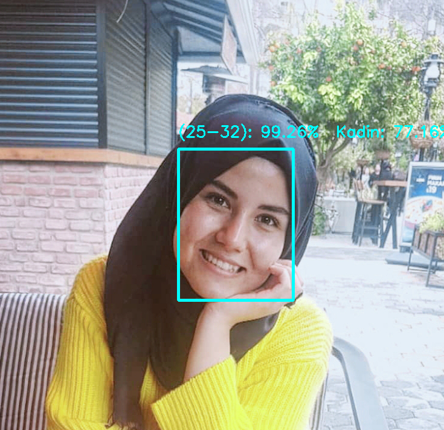

# Age-And-Gender-Prediction
Projede; gerçek zamanlı kamera görüntüsü ya da fotoğraflarda ki yüzler tespit edilip, derin öğrenme algoritmaları kullanılarak yaş ve cinsiyet tahmini yapılıyor.

Kodlar Adrian Rosebrock'un 'OpenCV Age Detection with Deep Learning' projesine dayanır. Proje geliştirilip cinsiyet tahmini eklenmiştir. 

Projede model olarak, açık kaynak kodlu derin öğrenme çerçevesi(framework) olan Caffe'nin CNN mimarisine dayalı, AlexNet benzeri hazır eğitilmiş modelleri kullanıldı. Modellerin eğitiminde Adience Benchmark veri seti kullanılmıştır. Veri seti kadın(female) ve erkek(male) olmak üzere 2 sınıfa ayrılmıştır. Yaş aralıkları ise (0-2), (4-6), (8-12), (15-20), (25-32), (38-43), (48-53), (60-100) olmak üzere 8 sınıfa ayrılmıştır. Her görüntü cinsiyete ve yaş bilgisine göre etiketlenmiştir.

**GEREKSİNİMLER**
- *Python 3.6*
- *Anaconda3 (Paket sürümleri conda paket yönetim sistemi ile yönetilir)*
- _OpenCV kütüphanesi_
- *Eğitilmiş Caffe modelleri* ( ```face-detector```, ```age-detector```, ```gender-detector``` )

**KULLANIM**

Fotoğrafta çalıştırmak için terminale şu kodu girin:

```python detect_age.py --face face_detector --age age_detector --gender gender_detector --image images/pp.jpg```

Gerçek zamanlı kamerada çalıştırmak için terminale şu kodu girin:

````python detect_age_video.py --face face_detector --age age_detector --gender gender_detector````

**TAHMİNİ SONUÇ**


